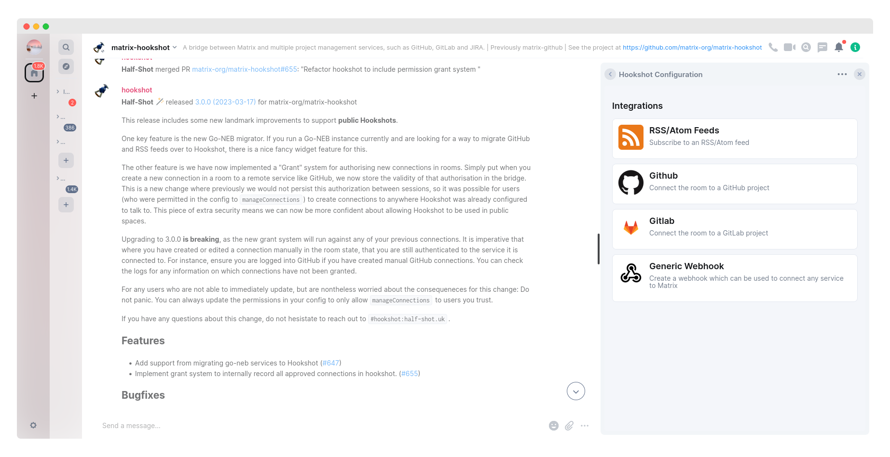

Matrix Hookshot
===============

[](https://matrix.to/#/#hookshot:half-shot.uk)
[](https://hub.docker.com/r/halfshot/matrix-hookshot)



A Matrix bot for connecting to external services like GitHub, GitLab, JIRA, and more.

- Several services are supported out of the box.
- [Webhooks](https://matrix-org.github.io/matrix-hookshot/latest/setup/webhooks.html) let you connect all kinds of services, with the ability to write rich templates using JavaScript.
- **No external database** is required, instead using Matrix state as a persistent store.
- End-to-Bridge encryption allows bots to be used in encrypted Matrix rooms.
- [Powerful widgets](https://matrix-org.github.io/matrix-hookshot/latest/advanced/widgets.html) let you configure Hookshot from a room or the Element Extensions Store.

We richly support the following integrations:

- [Figma](https://matrix-org.github.io/matrix-hookshot/latest/setup/figma.html)
- [Generic Webhooks](https://matrix-org.github.io/matrix-hookshot/latest/setup/webhooks.html)
- [GitHub](https://matrix-org.github.io/matrix-hookshot/latest/setup/github.html)
- [GitLab](https://matrix-org.github.io/matrix-hookshot/latest/setup/gitlab.html)
- [Jira](https://matrix-org.github.io/matrix-hookshot/latest/setup/jira.html)
- [RSS/Atom feeds](https://matrix-org.github.io/matrix-hookshot/latest/setup/feeds.html)

Get started by reading [the setup guide](https://matrix-org.github.io/matrix-hookshot/latest/setup.html)!


## Documentation

Documentation can be found on [GitHub Pages](https://matrix-org.github.io/matrix-hookshot).

You can build the documentation yourself by typing:
```sh
# cargo install mdbook
mdbook build
sensible-browser book/index.html
```

## Contact

We have a Matrix support room ([#hookshot:half-shot.uk](https://matrix.to/#/#hookshot:half-shot.uk)).
